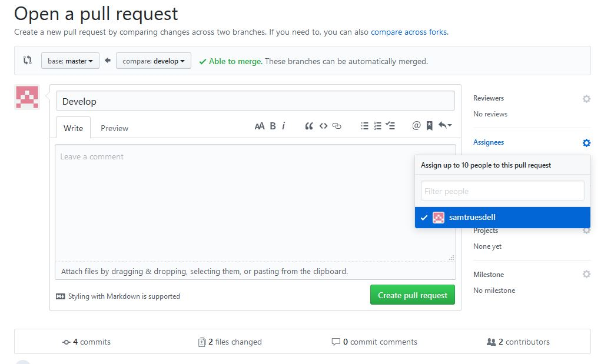
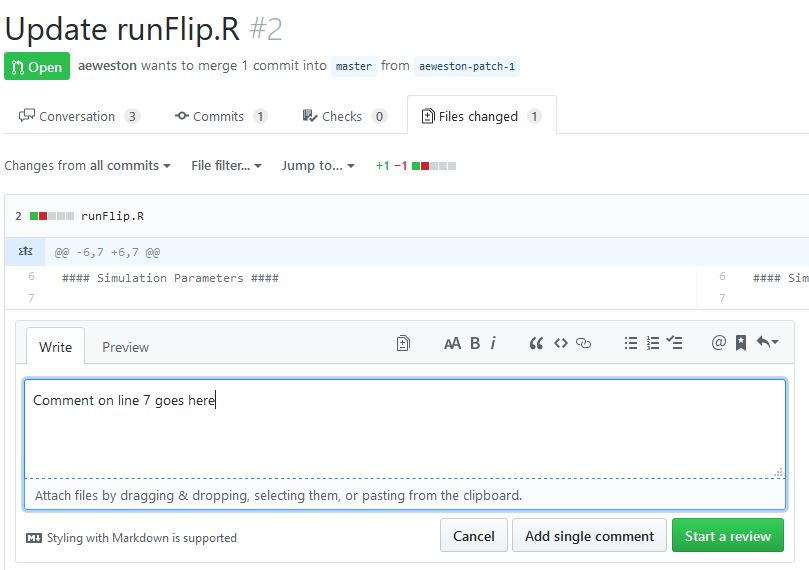
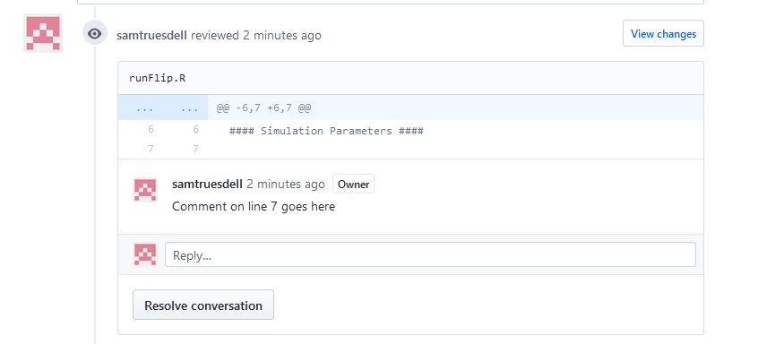

# GitHub workflow

The purpose of this document is to describe the intended workflow for updates to the groundfish-MSE code. This is important because we have multiple contributors.

If you are new to GitHub and are using RStudio, this is a pretty good tutorial: 

## Branches

* **Master**: The master branch. Ideally this branch will always be able to run with the available options in **mproc.txt**. Before other branches are merged into **Master** they have been reviewed by one or more people other than the author and thoroughly tested both on a local machine and on the HPCC. Merges to **Master** should come from the **Dev** branch rather than directly from feature branches.

  * *exception*: Small edits to the documentation are less critical -- it seems reasonable that these can be committed to the Master branch directly. Large changes to the documentation, like new files, could benefit from review however.

* **Dev**: The primary development branch. This is the "working" branch which represents code that has been vetted and tested. Whether changes should be committed directly to the **Dev** branch depends on the type of change.

  * Small changes can be committed directly without requesting reviews. These represent changes that have to do with testing the Dev branch and in general should be limited to (1) the set_om_parameters.R file, or (2) the mproc.txt file. Examples include:

    * Changing the number of simulations in the **set_om_parameters.R** file

    * Turning on or off the temperature effect

    * Changing which stock the MSE runs for

  * Large changes that don't have to do with testing are ideally not submitted directly to the **Dev** branch. Instead they should be submitted to a feature branch.

  Note that **Dev** (and any other branch) can be run directly from the HPCC by updating the syntax in **runPre.sh** (see [groundfish-MSE/documentation/runMSE.md](runMSE.md)).

* **Feature branches**: Named branches that represent substantial changes to the code. Before merging a feature branch into the Dev branch the code should be tested both on a local machine and on the HPCC and reviewed by someone else. The framework for the review should be through a pull request.

## Pull requests into Dev
Use a Pull Request when your changes to a branch are ready for prime time. This is the process to merge a branch you have been working on into the established model files. The philosophy behind the "request" is that the files get reviewed before they are integrated. To create a pull request, click on **Pull Request** in the list of branches on the GitHub site. You will then be taken to a page where you can describe the nature of the features and what in particular you would like to be evaluated by the reviewers. On the right-hand sidebar under reviewers choose at least one reviewer other than yourself to assign them the pull request to review.

Within a pull request (i.e., if you click on the pull request and open one to which you were assigned) there are some useful options including:

* **Comments**. Under this tab you can write comments and have a conversation about changes to the code. Anyone can participate.

* **Files changed**. Under this tab you can comment directly on part of the code by clicking on the plus sign that appears when you hover over a particular line.

  

 The comments you make will then appear under the **Conversation** tab along with a clip of the relevant lines of code.

  

## Pull requests into Master
Pull requests from **Dev** into **Master** are ideally not direct. The idea is that it might take a while to review a pull request, but that shouldn't stop people from making changes to the **Dev** branch. The workflow to merge **Dev** into **Master** is:

1. Create a **Release** branch directly from **Dev**
2. Create a Pull Request and assign individuals to review changes to the code
3. Once the code as been reviewed:
  * Merge **Release** into **Master**
  * Merge **Release** into **Dev** -- this is because while the **Release** branch was being reviewed, changes may have been made to **Dev**.

## Workflow summary
Below is the summary of the intended workflow on GitHub:

[Return to Wiki Home](https://github.com/thefaylab/groundfish-MSE/wiki)
